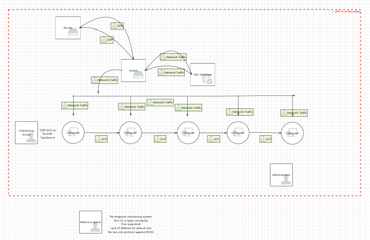

# STUXNET-Sandworm

---

[Google Drive](https://drive.google.com/drive/folders/1uLWTim-raxkSsFna4F0Mp8uyin1M9PBv?usp=sharing):  
Google Drive that contains all of the documentations including STRIDE/DREAD analysis, Threat model referenced to MITRE Atta&ck framework and many more..  
[Project Management](https://trello.com/b/0VTrZQST/team-kali):
Trello Board  
[Power Point Presentation](https://drive.google.com/file/d/1TTfUznWXxqBSs_GYd6GdHiaW87n7W1IH/view?usp=sharing)

---

Authors:  
<a href="https://github.com/kcboggs" target="_blank">*Kimberley Boggs*</a>  
<a href="https://github.com/marioepugh" target="_blank">*Mario Pugh*</a>  
<a href="https://github.com/jinwoov" target="_blank">*Jin Kim*</a>

---

## Application Information

This is repository is designed to mimic the `Stuxnet` incident around 2010. Script consists of variation of Stuxnet ransomware with remediation of blue team python script.  The source codes are purely for education purpose only.

---

## Data Flow Diagram

  
Depicts data flow between the trusted boundary network.

---

## Initial Whiteboard

  
Initial whiteboard before implementing security features.
 
  
Initial whiteboard after implementing security features.

---

## Resource

[Ubuntu16.04-Snort-Server](https://app.vagrantup.com/jinfluenza/boxes/Trisploit-snort-box/versions/1.0): Snort server hosted on Ubuntu machine hosted on `Vagrant`
[Windows10-Target-Machine](https://app.vagrantup.com/jinfluenza/boxes/Trisploit-Windows10-box): Windows machine that will be attacked from the host hosted on `Vagrant`

