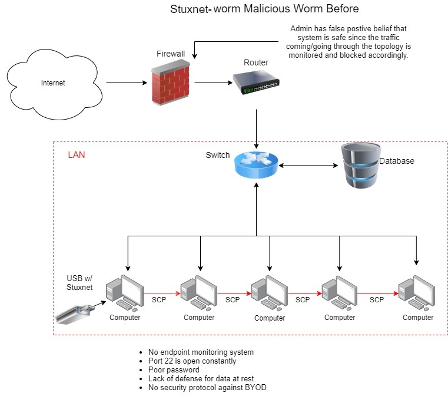
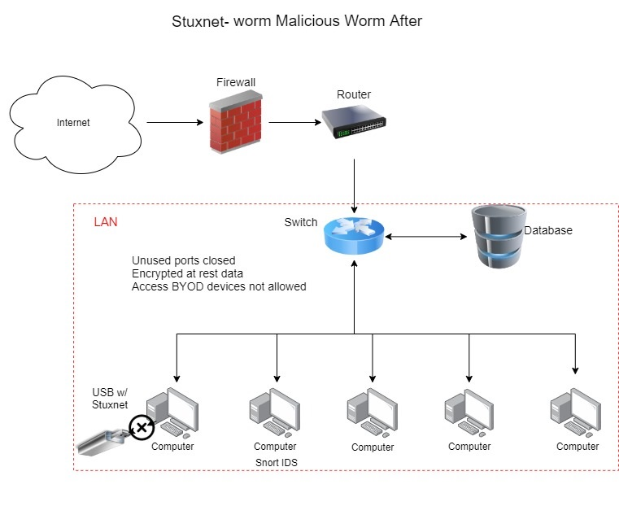

# STUXNET-Worm

---

[Google Drive](https://drive.google.com/drive/folders/1uLWTim-raxkSsFna4F0Mp8uyin1M9PBv?usp=sharing):  
Google Drive that contains all of the documentations including STRIDE/DREAD analysis, Threat model referenced to MITRE Atta&ck framework and many more..  
[Project Management](https://trello.com/b/0VTrZQST/team-kali):
Trello Board  
[Power Point Presentation](https://drive.google.com/file/d/1TTfUznWXxqBSs_GYd6GdHiaW87n7W1IH/view?usp=sharing)

---

Authors:  
<a href="https://github.com/kcboggs" target="_blank">*Kimberley Boggs*</a>  
<a href="https://github.com/marioepugh" target="_blank">*Mario Pugh*</a>  
<a href="https://github.com/jinwoov" target="_blank">*Jin Kim*</a>

---

## Stuxnet Information

This is repository is designed to mimic the `Stuxnet` incident around 2010. Script consists of variation of Stuxnet malware with mitigation using the blue team python script. Stuxnet malware is created from beginning to the fully functional executable file. 

Stuxnet is a malicious computer worm that traversed through the network by means of a USB flash drive. It was first discovered in 2010, but some suspect that it has been developed and passed around. It was exploiting four zero-day flaws, targeting machines using the Windows operating system seeking out Siemens Step7 software. The report projected that worm infected over 200,000 computers and caused 1,000 machines to be damaged after the infection. The worm was responsible for causing substantial damage to the nuclear program of Iran.

The source codes are purely for education purpose only.

---

## Tools Used

[Python](https://www.python.org/): Main language that application is compiled from.  
[Virtual Box](https://www.virtualbox.org/): Used to run the virtual state.  
[Vagrant](https://app.vagrantup.com/): Used for deploying VM to the cloud storage.  
[Microsoft Threat Modeling Tools](https://www.microsoft.com/en-us/download/details.aspx?id=49168): Used this tool to create a data flow diagram.  
[Snort](https://www.snort.org/): Network intrusion detection system.  

---

## Frameworks

[STRIDE](https://docs.microsoft.com/en-us/azure/security/develop/threat-modeling-tool-threats), [DREAD](https://resources.infosecinstitute.com/topic/qualitative-risk-analysis-dread-model/), [NIST-800](https://www.nist.gov/topics/cybersecurity), [MITRE ATT&CK](https://attack.mitre.org/matrices/enterprise/windows/), [Lockheed APT Kill Chain](https://www.lockheedmartin.com/en-us/capabilities/cyber/cyber-kill-chain.html), and [Atomic Red Team](https://github.com/redcanaryco/atomic-red-team)

---

## Data Flow Diagram

  
Depicts data flow between the trusted boundary network.

---

## Initial Whiteboard

  
Initial whiteboard before implementing security features.
 
  
Initial whiteboard after implementing security features.

---

## Resource

[Ubuntu16.04-Snort-Server](https://app.vagrantup.com/jinfluenza/boxes/Trisploit-snort-box/versions/1.0): Snort server hosted on Ubuntu machine. Hosted on `Vagrant`  
[Windows10-Target-Machine](https://app.vagrantup.com/jinfluenza/boxes/Trisploit-Windows10-box): Windows machine that will be attacked from the host. Hosted on `Vagrant`  
[Windows10-Infected-Machine](https://app.vagrantup.com/jinfluenza/boxes/Trisploit-Windows10-infected-host): Windows machine that is infected will be spreading Stuxnet malware. Hosted on `Vagrant`

